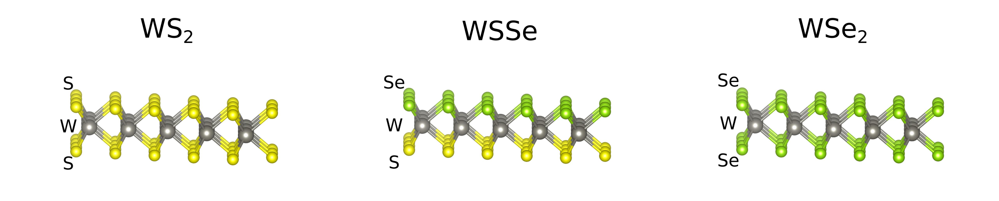

# Controlled conversion of 2D monolayers

This repository houses the source code and image files used in the analysis presented in Harris, S. B. et al. *Real-Time Diagnostics of 2D Crystal Transformations by Pulsed Laser Deposition: Controlled Synthesis of Janus WSSe Monolayers and Alloys.* ACS Nano 2023. https://doi.org/10.1021/acsnano.2c09952.

Images were acquired using a scanning transmission electron microscope (STEM) (Nion UltraSTEM 200 operated at 100 kV accelerating voltage). The material began as a single layer of WS2 and was selenized using pulsed laser deposition. Given enough selenization the material will eventually lose all the S atoms and convert fully to WSe2. Atomic models of these structures are illustrated below. In this work we examine this conversion process and determine that the Se primarily selenizes the top side before beginning conversion of the bottom side resulting in an intermediate, Janus structure WSSe where the top is primarily Se and the bottom primarily S.

The analysis workflow is presented in 'comparing_janus_intensities.ipynb'. Two sets of images are contained in the 'Partially converted images' and 'Fully converted images' folders. 'Rescaled' images are output from the analysis workflow. The other images were preprocessed using the background subtraction plugin for Imagej and are used as input for the analysis workflow. Output figures are stored in the 'Figure output' folder.

